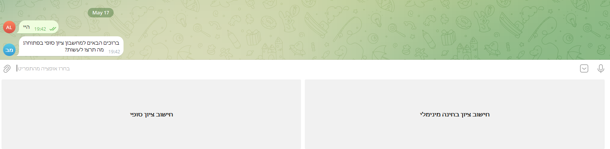
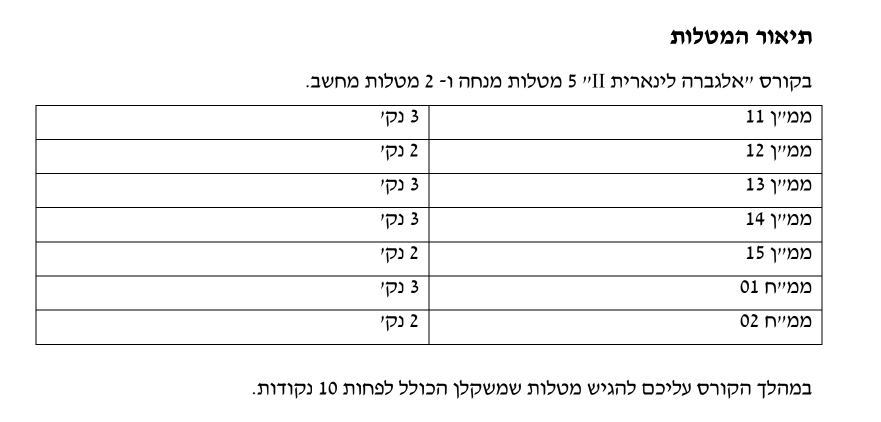
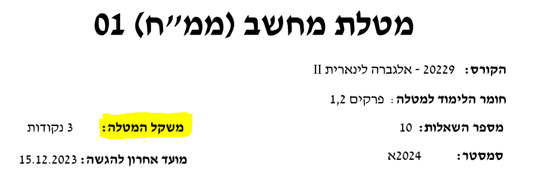

# מחשבון ציון סופי - האוניברסיטה הפתוחה

## הסבר 
 חישוב הציון הסופי של קורס באוניברסיטה הפתוחה מתחשב לא רק בציון המבחן אלא גם בציוני המטלות, לכל מטלה משקל שונה מה שהופך את חישוב הציון הסופי למסורבל.

##  מה הבוט כולל? 

###   חישוב ציון סופי 
כאשר תבחרו באופציה זו עליכם להכניס את ציוני המטלות ומשקליהם, ואת ציון הבחינה שלכם.
הבוט יחשב ויציג לכם את הציון הסופי של הקורס שלכם.
### חישוב ציון בחינה מינימלי 
כאשר תבחרו באופציה זו עליכם להכניס את ציוני המטלות ומשקליהם, ואת הציון הסופי הרצוי שלכם. הבוט יחשב ויציג לכם את **הציון המינימלי בבחינה** אשר עליכם לקבל על מנת שתקבלו את ציון הקורס הרצוי.

## משקלי המטלות 
בכל חוברת קורס (איפה שמופיע לנו הממנים והממחים) קיים לנו טבלה עם תיאור המשקלים:

בנוסף בראש כל מטלה רשום את משקל המטלה:

## הדמייה

## הרצה
שלבים להרצת הבוט בעצמכם:
- יצירת token באמצעות [המדריך](https://core.telegram.org/bots#how-do-i-create-a-bot)
- עריכת המשתנה BOT_TOKEN בDockerfile
- התקנת הcontainer באמצעות קובץ הDockerfile והרצתו
