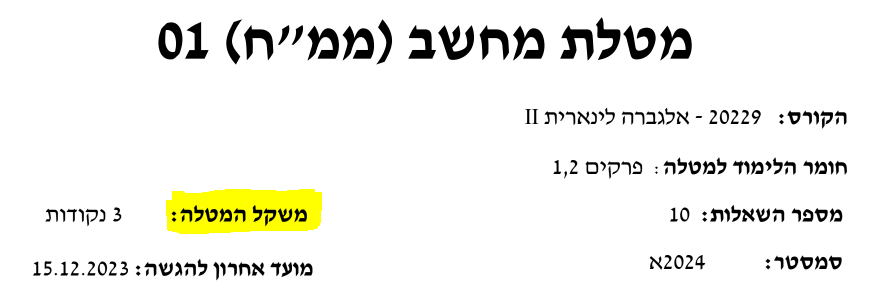

<div dir="rtl">

# מחשבון ציון סופי - האוניברסיטה הפתוחה

## הסבר 
חישוב הציון הסופי של קורס באוניברסיטה הפתוחה מתחשב לא רק בציון המבחן אלא גם בציוני המטלות, לכל מטלה משקל שונה מה שהופך את חישוב הציון הסופי למסורבל.

## מה הבוט כולל? 


### חישוב ציון סופי 
כאשר תבחרו באופציה זו עליכם להכניס את ציוני המטלות ומשקליהם, ואת ציון הבחינה שלכם. הבוט יחשב ויציג לכם את הציון הסופי של הקורס שלכם.

### חישוב ציון בחינה מינימלי 
כאשר תבחרו באופציה זו עליכם להכניס את ציוני המטלות ומשקליהם, ואת הציון הסופי הרצוי שלכם. הבוט יחשב ויציג לכם את **הציון המינימלי בבחינה** אשר עליכם לקבל על מנת שתקבלו את ציון הקורס הרצוי.

## משקלי המטלות 
בכל חוברת קורס (איפה שמופיע לנו הממנים והממחים) קיים לנו טבלה עם תיאור המשקלים:

בנוסף בראש כל מטלה רשום את משקל המטלה:


## הדמייה


## הרצת הבוט

### הרצה על הקונסול
1. יצירת token באמצעות [המדריך](https://core.telegram.org/bots#how-do-i-create-a-bot).
2. הגדרת משתנה הסביבה `BOT_TOKEN`:
    ```bash
    export BOT_TOKEN='your_token_here'
    ```
3. הרצת הבוט עם:
    ```bash
    python main.py
    ```

### הרצה עם Docker
1. יצירת token באמצעות [המדריך](https://core.telegram.org/bots#how-do-i-create-a-bot).
2. עריכת קובץ ה- `Dockerfile` להכללת הטוקן. הוסיפו את השורה הבאה:
    ```dockerfile
    ENV BOT_TOKEN='your_token_here'
    ```
3. בניית אימג' Docker:
    ```bash
    docker build -t final-grade-calculator .
    ```
4. הרצת הקונטיינר של Docker:
    ```bash
    docker run -d --name final-grade-calculator final-grade-calculator
    ```

בעזרת שלבים אלה, תוכלו לבחור להריץ את הבוט ישירות על הקונסול שלכם או בתוך קונטיינר של Docker, בהתאם להעדפתכם.
